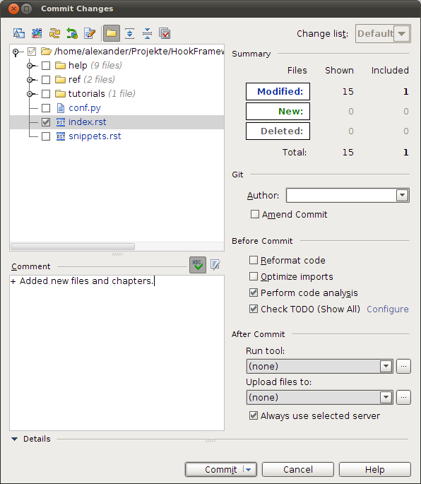

.. _svn.listener.info:

Information listener
====================
The `info listener` gets the *Info* object to process the listener. The main intention of this
listener is to handle the information of a commit.

Available Functions for *Info* object
-------------------------------------
Here is a list of the available function of the *Info* object that is passed to the listener in the
:doc:`process function <svn.listener.process>`

getUser()
~~~~~~~~~
Gets the user of that commit. Passed via hook script.

Values: Phoebe, Duchess, etc.

getDateTime()
~~~~~~~~~~~~~
Returns the Date and Time of that commit.

Actual the format is: 2008-12-30 12:34:56

getMessage()
~~~~~~~~~~~~
Returns the commit message of that commit that comes with the IDE or on the command line with the
option -m "Message", if it is given.

getObjects()
~~~~~~~~~~~~
All files that were commited.

Returns an Array with the `file objects <svn.listener.object>` of the commit.

.. note::

   You can access the objects, but the temporary files will not be created.

Example
-------

Example of a Info listener that just mails the information of a commit to a given adress.

.. code-block:: php

   <?php
   /**
    * Mailing Listener.
    * @category   Listener
    * @package    Post
    * @subpackage Post
    * @author     Alexander Zimmermann <alex@azimmermann.com>
    * @copyright  2008-2012 Alexander Zimmermann <alex@azimmermann.com>
    * @license    http://www.opensource.org/licenses/bsd-license.php  BSD License
    * @version    SVN: $Id:$
    * @link       http://www.azimmermann.com/
    * @since      File available since Release 1.0.0
    */

   namespace Example\Post;

   use Hook\Commit\Data\Info;
   use Hook\Listener\AbstractInfo;

   /**
    * Mailing Listener.
    * @category   Listener
    * @package    Post
    * @subpackage Post
    * @author     Alexander Zimmermann <alex@azimmermann.com>
    * @copyright  2008-2012 Alexander Zimmermann <alex@azimmermann.com>
    * @license    http://www.opensource.org/licenses/bsd-license.php  BSD License
    * @version    Release: 2.1.0
    * @link       http://www.azimmermann.com/
    * @since      Class available since Release 1.0.0
    */
   class Mailing extends AbstractInfo
   {
   	/**
   	 * Listener Name.
   	 * @var string
   	 */
   	protected $sListener = 'Post Commit Mailing';

   	/**
   	 * Register the action.
   	 * @return string
   	 */
   	public function register()
   	{
   		return 'commit';
   	} // function

   	/**
   	 * Execute the action.
   	 * @param Info $oInfo Info des Commits.
   	 * @return string
   	 */
   	public function processAction(Info $oInfo)
   	{
   		$sMailBody  = 'Date Time : ' . $oInfo->getDateTime() . "\n\n";
   		$sMailBody .= 'User      : ' . $oInfo->getUser() . "\n";
   		$sMailBody .= "\n";
   		$sMailBody .= 'Comment   : ' . $oInfo->getMessage() . "\n\n";

   		$sMailBody .= str_repeat('=', 80) . "\n";

   		$sMailBody .= 'Files ' . "\n";
   		foreach ($oInfo->getObjects() as $oObject)
   		{
   			// Just add the files in the commit in a simple format.
   			$sMailBody .= $oObject->getAction() . ' ' . $oObject->getObjectPath() . "\n";
   		} // foreach

   		// Mail it.
   		$sHeader  = 'From: webmaster@example.com' . "\r\n";
   		$sHeader .= 'Reply-To: webmaster@example.com' . "\r\n";
   		$sHeader .= 'Content-Type: text/plain; char-set=UTF-8' . "\r\n";
   		$sHeader .= 'X-Mailer: PHP/' . phpversion();

   		mail('alex@aimmermann.com', 'SVN Commit', $sMailBody, $sHeader);
   	} // function
   } // class
